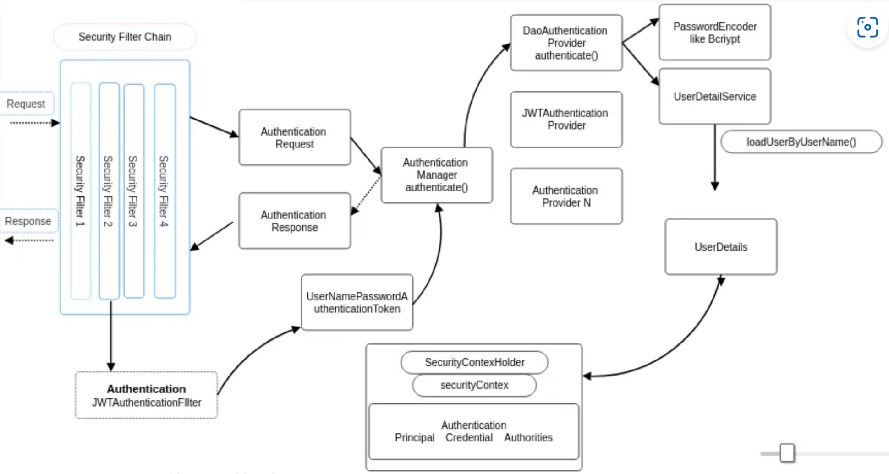
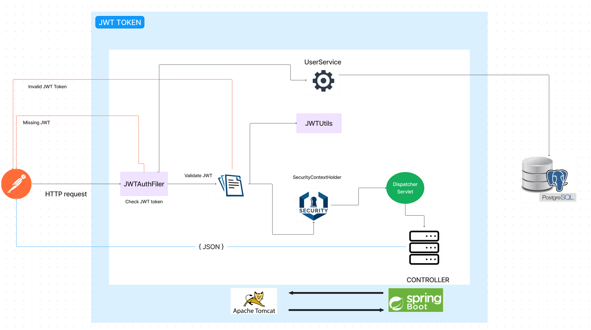

# JWT register & login

- This project handles authentication through JDBC (Database)
- Spring Secururity is based on Servlet Filters.
- Signing algorithm HMAC SHA256.

# JSON Web Tokens (JWT)
- JSON Web Tokens (JWT) are a standard method for securely transmitting information as a JSON object.
- Three parts: Header, Payload, Signature.
  In a JWT-based authentication process, users log in with their credentials to receive a JWT. 
- After logging in, they include this token in their requests to access secure resources.
- Website: https://jwt.io/

### Header 
- typically consist of `"alg": "HS256"` and `"typ":"JWT"`.

### Payload
- Registered Claims are predefined claims recommended by JWT. Such as issuer, subject, expiration time, issuance time.
- Public Claims are custom claims defined by JWT creator. Such as email and role.
- Private Claims are custom claims. Applicaton-specific claims.  

### Signature
- you have to take the encoded header, the encoded payload, a secret and algorithm in header and sign it.
- `HMACSHA256(
   base64UrlEncode(header) + "." + 
   base64UrlEncode(payload), 
   secret)`

## SecurityContextHolder
- Holds the details of current authentication and authorization info.  
- SecurityContext contains the principal (authenticated user) and their granted authorities.

## AuthenticationManager && AuthenticationProvider  (interface)
- Responsible for authenticating a user based on their credentials. 

# GrantedAuthority 
- An authority granted to a user.
- Usually roles or permission to define what actions a user can perform. 
- Used SimpleGrantedAuthority. 

## Details
 

1. Request goes through SecurityConfig (securityFilterChain)
- Disabled csrf, often used in stateless authentication with tokens. 
- Configure some specific endpoints to access.
- Set session creation polciy to be stateless, won't create HTTP sessions for security. 
- Defined AuthenticationProvider.
- At last go through `JWTAuthFilter`.

2. JWTAuthFilter
- Fetch JWT through Header `Authorization`.
- If token valid, create an empty SecurityContext.
- Create UsernamePasswordAuthenticationToken based on user details/credentials. 
- Add additional details with `WebAuthenticationDetailsSource()` for the current request. 
- Set authentication for securityContext using token. 
- set context for securityContextHolder using securityContext.

## Overall Architecture

# Run project
- mvn spring-boot:run

# Run project with remote JVM Debug
- mvn spring-boot:run -Dspring-boot.run.jvmArguments="-Xdebug -Xrunjdwp:transport=dt_socket,server=y,suspend=y,address=8001"
