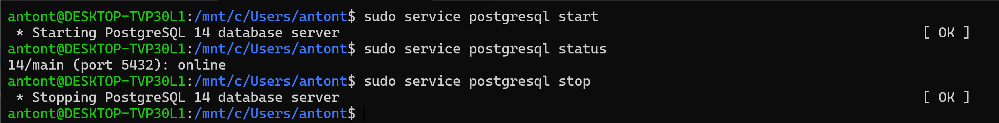
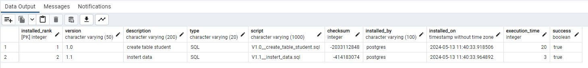

# Student with CRUD-operations

- Easy CRUD-operations (JpaRepository)
- Database PostgresSQL
- Flyway

# PostgreSQL WSL

- `sudo service postgresql start`
- `sudo service postgresql status`
- `sudo service postgresql stop`

# Flyway Schema History

# Run project
- mvn spring-boot:run

# Run project with remote JVM Debug
- mvn spring-boot:run -Dspring-boot.run.jvmArguments="-Xdebug -Xrunjdwp:transport=dt_socket,server=y,suspend=y,address=8001"

